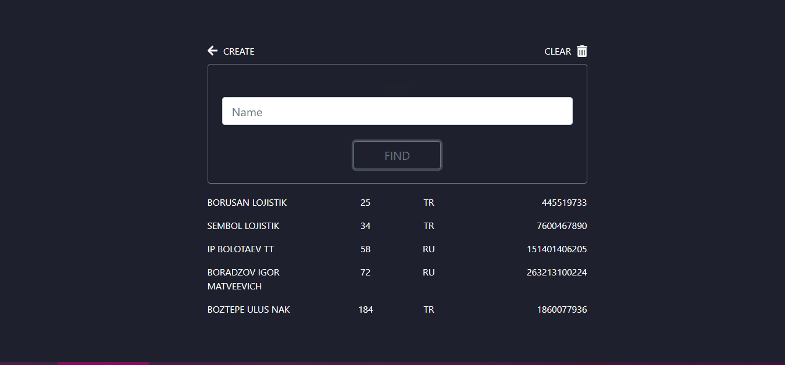

# carrier-app

Created this app to automate some routine tasks and speed up working processes at my company where I'm currently working for. 

The App's search tool allows quick access to a carrier's database (MongoDB) files using one search query. 

Also there is an option to enter a new carrier into existing database. A sequential number for each record is being assigned automatically.

